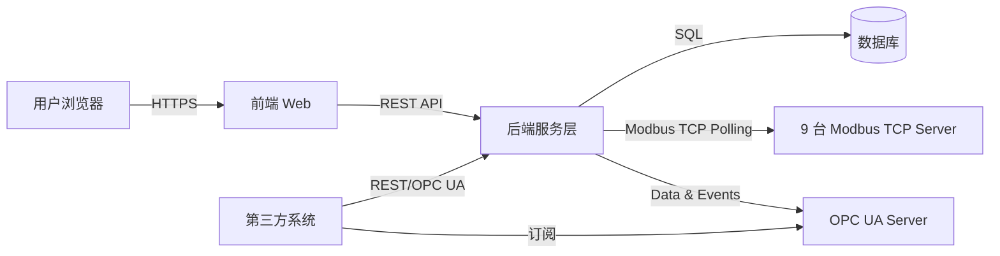

# 集中供料系统（UNET管理系统）设计蓝图

## 1. 概述

集中供料系统（UNET管理系统）面向工厂集中供料环节，提供设备状态监控、任务调度、数据共享与可视化能力。本设计蓝图在原有需求文档的基础上，对系统架构、功能划分、接口规范、数据模型与非功能性指标进行结构化定义，为后续详细设计、开发与实施提供依据。

主要目标：

* 建立统一的集中供料管理平台，实现 9 台 Modbus TCP Server 设备的接入与监控。
* 与第三方业务系统双向交互，实现任务流转与数据共享。
* 提供 OPC UA Server 能力，对内对外统一暴露实时数据与事件。
* 保障系统安全、可扩展、易维护，并满足性能与验收要求。

---

## 2. 系统总体架构

系统采用浏览器访问（BS 架构），核心组件包括：

* **前端 Web 应用**：负责界面呈现与用户交互，建议采用 Vue/React 等现代框架。
* **后端服务层**：基于 Python（Flask 或 FastAPI），实现业务逻辑、接口处理与数据聚合。
* **数据采集层**：Modbus TCP Client 模块轮询 9 台 Server 设备；数据映射后写入内部缓存与数据库。
* **OPC UA Server**：统一发布设备实时数据与事件，供第三方系统订阅。
* **数据库**：存储业务数据、历史记录、日志等（MySQL 或 SQL Server）。
* **第三方系统接口**：通过 RESTful API 或 OPC UA 实现任务与数据的交互。



---

## 3. 功能模块与职责

### 3.1 用户与权限管理

* 用户注册/登录、注销、密码管理。
* 角色定义：管理员、操作员、只读用户等。
* 基于角色的功能与数据访问控制。
* 登录审计、操作日志记录。

### 3.2 集中供料监控

* Modbus 数据采集周期 ≤ 5 秒，实时展示料斗、管路、设备状态。
* 关键点位：料位、温度、阀门状态、运行状态、报警标志等。
* 支持状态总览、设备详情、趋势曲线、报警看板。
* 通讯异常报警、历史报警查询与导出。

### 3.3 任务调度与执行

* 接收第三方系统下发的生产任务，入队排程。
* 提供本地任务创建与编辑功能。
* 任务执行过程跟踪：待执行、执行中、完成、失败等状态。
* 执行结果与异常反馈回第三方系统。
* 任务与设备绑定策略，支持优先级调度与并发控制。

### 3.4 接口对接逻辑

* **系统开放接口**（接口 1 / 5 / 6）供第三方系统调用，完成任务下发、状态同步等动作。
* **系统消费第三方接口**，用于拉取计划、反馈结果、同步主数据等。
* **接口 4**：基于点位变化触发事件监听，可通过 Modbus 轮询或 OPC UA DataChange 订阅实现。
* 支持 Webhook/MQ 等异步通知方式，降低第三方耦合度。

### 3.5 数据管理

* 实时数据与历史数据存储、查询。
* 报表统计：产量、设备利用率、报警统计等。
* 数据导出：CSV/Excel。
* 数据留存策略与归档计划。

---

## 4. 通信与集成设计

### 4.1 Modbus TCP

* **连接策略**：每台设备独立连接池，轮询周期 ≤ 5 秒，可配置。
* **点位管理**：维护 Modbus 点表（Holding Register、Coil 等），支持动态扩展。
* **采集流程**：
  1. 定时任务触发采集线程。
  2. 读取点位并进行数据校验与单位换算。
  3. 写入实时缓存并落库，触发阈值/报警逻辑。
  4. 异常（超时、CRC 错误等）记录日志并触发报警。
* **控制能力**：对部分 Coil 或 Holding Register 支持写操作，需权限校验与操作日志。

### 4.2 OPC UA Server

* **点位映射**：依据 Modbus 点表，构建 OPC UA Address Space，包含设备、子系统、点位层级。
* **数据发布**：
  * 周期更新 Value 与 Timestamp。
  * 支持 Deadband、阈值过滤以减少网络负载。
* **事件模型**：自定义 EventType，在阈值越界、状态变化、任务事件时触发。
* **安全策略**：用户名/密码登录，支持后续扩展证书与加密通道。
* **接口 4 实现**：通过 OPC UA 订阅回调触发业务逻辑（如 HTTP 回调、消息队列或直接更新数据库）。

### 4.3 第三方系统 REST 接口

* 安全机制：Token/JWT 鉴权，HTTPS 传输。
* 异常策略：统一错误码、重试机制、日志追踪。
* 支持双向调用——系统提供开放接口，同时消费第三方接口。

---

## 5. API 设计示例

### 5.1 通用规范

* **协议**：HTTP/HTTPS。
* **数据格式**：JSON，编码 UTF-8。
* **鉴权**：HTTP Header `Authorization: Bearer <token>`。
* **通用响应结构**：

```json
{
  "code": 0,
  "message": "success",
  "data": {}
}
```

### 5.2 开放接口示例

| 接口编号 | 功能说明               | 方法 | URL                    | 请求体关键字段                                                                 | 响应示例                                         |
|----------|------------------------|------|------------------------|---------------------------------------------------------------------------------|--------------------------------------------------|
| 接口 1   | 生产任务下发           | POST | `/api/v1/task/receive` | `task_id`, `material_code`, `target_device`, `quantity`, `priority`             | `{ "status": "accepted", "message": "Task queued successfully" }` |
| 接口 5   | 任务执行状态查询       | GET  | `/api/v1/task/{id}`    | 路径参数 `id`                                                                   | `{ "task_id": "T20250918001", "status": "running" }`          |
| 接口 6   | 系统状态/报警推送订阅 | POST | `/api/v1/alerts/subscribe` | `callback_url`, `event_types`                                               | `{ "status": "accepted" }`                                |

### 5.3 系统消费第三方接口

* 接收主数据更新：同步物料、设备、工单等基础信息。
* 推送任务执行反馈：按任务周期上报进度、结果与异常。
* 触发事件通知：接口 4 对应的点位变化可回调至第三方 API。

---

## 6. 数据库模型建议

| 模块           | 关键表           | 主要字段示例                                                                                  |
|----------------|------------------|------------------------------------------------------------------------------------------------|
| 用户与权限     | `users`          | `id`, `username`, `password_hash`, `role`, `status`, `last_login_at`                           |
|                | `roles`          | `id`, `name`, `description`                                                                    |
|                | `permissions`    | `id`, `code`, `name`                                                                           |
|                | `role_permissions` | `role_id`, `permission_id`                                                                  |
| 任务调度       | `tasks`          | `id`, `task_id`, `material_code`, `target_device`, `quantity`, `priority`, `status`, `source`  |
|                | `task_logs`      | `id`, `task_id`, `status`, `message`, `reported_at`, `extra`                                   |
| 设备与点位     | `devices`        | `id`, `code`, `name`, `type`, `ip`, `port`, `status`                                           |
|                | `tags`           | `id`, `device_id`, `tag_code`, `description`, `modbus_addr`, `data_type`, `opc_node_id`, `unit` |
| 数据采集与报警 | `realtime_data`  | `tag_id`, `value`, `quality`, `timestamp`                                                      |
|                | `history_data`   | `id`, `tag_id`, `value`, `quality`, `timestamp`                                                |
|                | `alarms`         | `id`, `tag_id`, `level`, `message`, `raised_at`, `cleared_at`, `ack_user`                       |
| 审计日志       | `audit_logs`     | `id`, `user_id`, `action`, `resource`, `result`, `ip`, `created_at`                            |

*针对不同数据库（MySQL/SQL Server），需结合具体实现选择字段类型、索引策略与分区策略。*

---

## 7. 安全与权限

* 用户鉴权：JWT + 刷新 Token，前端存储在安全容器（如 HttpOnly Cookie）。
* 权限控制：基于 RBAC，后端接口与前端组件均需校验。
* 数据安全：
  * HTTPS 强制启用。
  * 关键操作（写入设备点位等）需二次确认与审批流程。
  * 定期备份数据库与配置。
* 日志与审计：
  * API 访问日志、设备通讯日志、系统操作日志分级记录。
  * 异常告警通知（邮件、短信或企业 IM）。

---

## 8. 非功能性指标与运维

* **性能**：
  * 支持 ≥ 50 并发用户，接口响应时间 ≤ 1 秒。
  * Modbus 轮询整体延迟 ≤ 1 秒，数据刷新 ≤ 5 秒。
* **高可用**：
  * 服务与数据库可部署主备或容器化，实现快速恢复。
  * 关键任务采用消息队列或补偿机制，确保任务不丢失。
* **扩展性**：
  * 模块化代码结构，支持添加新设备、新接口、新报表。
  * 点位表与设备管理支持配置化扩展。
* **部署建议**：
  * 支持 Windows / Linux 服务器，优先考虑 Docker 容器化部署。
  * 持续集成（CI）与持续交付（CD）流程管理。

---

## 9. 验收与测试策略

* **接口测试**：使用 Postman/Swagger 逐项验证开放接口、第三方调用接口。
* **设备通讯测试**：模拟/真实环境验证 9 台 Modbus TCP Server 采集，误差 ≤ 1 秒。
* **OPC UA 测试**：第三方 Client 订阅数据与事件，验证接口 4 触发逻辑。
* **功能测试**：覆盖用户管理、任务调度、数据展示、报警处理等功能。
* **性能测试**：压测接口与 Modbus 采集，验证并发承载能力。
* **安全测试**：鉴权、权限、SQL 注入、XSS 等安全项检查。

---

## 10. 后续工作建议

1. 输出详细需求规格说明书（SRS），补充用例、数据字典、界面原型。
2. 制定项目计划与迭代路线，明确优先级与里程碑。
3. 建立开发规范（代码规范、分支策略、CI/CD 管理）。
4. 搭建原型系统，验证 Modbus、OPC UA、REST 接口等关键链路。
5. 基于本设计蓝图开展详细设计与开发实现。

---

> 本文档与原始需求同步更新，后续迭代可在 `docs/` 目录维护版本化设计资料。
